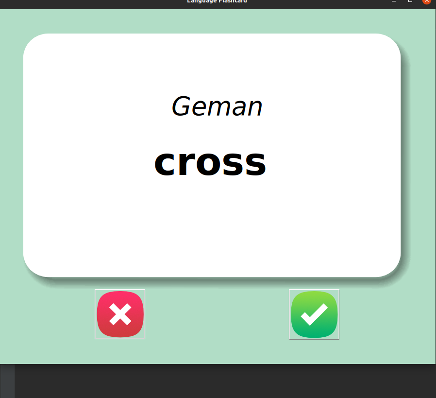

# Germany_lang_flashcard_APP

A flash card app to help learn Germany language.

# ⚙️ How it works:

- Random German word is selected from a language file.
- User has 3 seconds to guess the English meaning of the word before the card is flip to the English version.
- User click on the check button and the word is removed from the language list and assumed the player now knows the
  word.
- User clicks the Red / wrong button and a new random word is selected. 

#📇 Packages:
- Thkinter.
- Pandas.
- Random.

### Tips on improvement welcome 😉.
