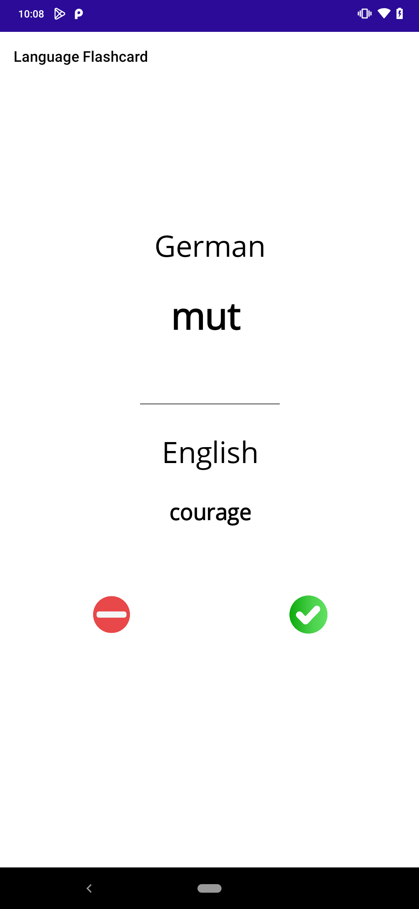

# Germany_lang_flashcard_APP

An andriod flash card app to help learn german.

# ⚙️ How it works

- Random German word is selected from a language file.
- User has 3 seconds to guess the english meaning of the word before the card is flip to the English version.
- User clicks on the check button and the word is removed from the language list assuming using now knows the word.
- User clicks the wrong button, given word is added to words to learn list and a new random word is selected.
